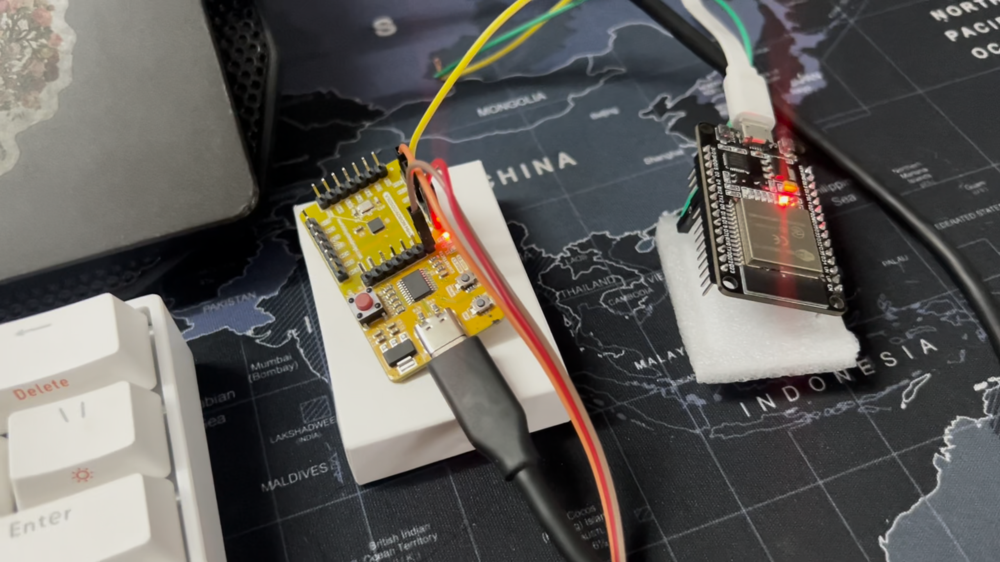

# HOME AUTOMATION USING ARDUINO IOT CLOUD 

## PROJECT OVERVIEW
In this project, We build a system that utilises CH32V003 RISC-V processor and the Arduino IOT cloud to convert traditional home appliances into IoT-enabled devices. The system incorporates the ESP32 for its built-in Wi-Fi and Bluetooth capabilities. When the user sends an ON/OFF command through the Arduino IOT cloud app/web appplication, the signal is transmitted to the ESP32 via Wi-Fi, which then activates a GPIO port in the VSDsquardron mini. This signal controls a servo motor connected to the VSDsquadron mini, allowing for remote operation of the home appliances.  By integrating the Arduino IOT cloud with the CH32V003 RISC-V processor and ESP32, users can conveniently manage their appliances from anywhere using a smartphone or tablet. This enhances user convenience, improves energy efficiency by enabling remote power management, and adds a layer of automation to household tasks. Additionally, the use of IoT technology increases the versatility and functionality of conventional home appliances, aligning them with modern smart home standards.

## PINOUT DIAGRAM


## Table for pin connections

| Servo motor(SG90)  | CH32V003x |
| ------------- | ------------- |
| Control pin (Blue wire) | PD4 |
| Power pin (Red wire)  | 5V |
| Ground pin (black wire) | GND |

| ESP32 | CH32V003x |
| ------------- | ------------- |
| Digital pin 4 (Orange wire) | PD2 |

## Components required
| Components| Quantity |
| ------------- | ------------- |
| VSDsquadron mini | 1 |
| ESP 32  | 1 |
| servo motor(SG90) | 1 |
| Jumper wires | As per required |

## Demonstration video
[](https://drive.google.com/file/d/16y3WWIxM0j3iQrkFy_5D158Ioe6KJkg4/view?usp=sharing)

## fault injection

Injecting a fault into a microcontroller code can be done in several ways, depending on what kind of fault you want to simulate. Here are a few possibilities:

- Voltage Glitching: This involves momentarily lowering the voltage supply to the microcontroller, which can cause it to execute instructions incorrectly or behave unpredictably.

- Clock Glitching: Similar to voltage glitching, this involves momentarily disrupting the clock signal to the microcontroller, causing it to execute instructions incorrectly.
-Memory Corruption: Writing data to random memory locations can simulate faults caused by cosmic rays or other forms of radiation.

- Instruction Corruption: Modifying the program instructions in memory can cause the microcontroller to execute unintended instructions.

- Peripheral Fault Injection: Intentionally sending incorrect data to peripherals, such as sensors or communication modules, can simulate faults in external components.


since we work with a servo motor, its supposed to perform its action periodically when it receives the commans from input pin. To introduce a fault scenario where the servo motor behaves unexpectedly or inaccurately due to a random glitch.We can simulate this by randomly delaying the servo control pulses within a certain range, causing undesired behaviour behavior. To inject the fault using an ESP32 board, we can modify the code to receive commands from the ESP32 over serial communication to introduce the fault. Here's how we can do it.

```cpp
#define SERVO_PIN PD4
#define INPUT_PIN PD2

void setup() {
  Serial.begin(9600); // Initialize serial communication
  pinMode(SERVO_PIN, OUTPUT);
  pinMode(INPUT_PIN, INPUT);
  digitalWrite(SERVO_PIN, LOW); // Set the initial position of the servo to 90 degrees
}

void loop() {
  static bool prevInputState = LOW; // Variable to store the previous state of the input pin
  
  // Read the current state of the input pin
  bool currentInputState = digitalRead(INPUT_PIN);
  
  // Check if the input pin transitioned from LOW to HIGH
  if (currentInputState == HIGH && prevInputState == LOW) {
    // Sweep the servo from 90 to 150 degrees
    for (int angle = 90; angle <= 150; angle++) {
      int pulseWidth = map(angle, 0, 180, 500, 2500); // Map the angle to the PWM pulse width
      digitalWrite(SERVO_PIN, HIGH);
      delayMicroseconds(pulseWidth);
      digitalWrite(SERVO_PIN, LOW);
      delay(15);
      checkForFault(); // Check for fault after each servo pulse
    }
    
    // Return the servo to the initial position (90 degrees)
    digitalWrite(SERVO_PIN, HIGH);
    delayMicroseconds(1500); // Set the pulse width for 90 degrees
    digitalWrite(SERVO_PIN, LOW);
    delay(15);
  }
  
  // Check if the input pin transitioned from HIGH to LOW
  if (currentInputState == LOW && prevInputState == HIGH) {
    // Sweep the servo from 90 to 30 degrees
    for (int angle = 90; angle >= 10; angle--) {
      int pulseWidth = map(angle, 0, 180, 500, 2500); // Map the angle to the PWM pulse width
      digitalWrite(SERVO_PIN, HIGH);
      delayMicroseconds(pulseWidth);
      digitalWrite(SERVO_PIN, LOW);
      delay(15);
      checkForFault(); // Check for fault after each servo pulse
    }
    
    // Return the servo to the initial position (90 degrees)
    digitalWrite(SERVO_PIN, HIGH);
    delayMicroseconds(1500); // Set the pulse width for 90 degrees
    digitalWrite(SERVO_PIN, LOW);
    delay(15);
  }
  
  // Update the previous input state
  prevInputState = currentInputState;
}

void checkForFault() {
  if (Serial.available() > 0) { // Check if data is available to read from serial
    char command = Serial.read(); // Read the command from serial
    if (command == 'F') { // If the command is 'F' (for fault), introduce a random delay
      delay(random(10, 20)); // Introduce a random delay between 10 to 20 milliseconds
    }
  }
}

```
```cpp
void setup() {
  Serial.begin(9600); // Initialize serial communication
}

void loop() {
  if (Serial.availableForWrite()) {
    Serial.write('F'); // Send the fault injection command 'F' over serial
    delay(1000); // Delay for 1 second before sending the next command
  }
}
```

When the ESP32 sends the 'F' command over serial, the CH32V003 board will introduce a random delay after each servo pulse, simulating a fault.

### Fault Injection Using Voltage Glitching

Fault injection using voltage glitching is a technique employed in security research and hardware testing to induce transient faults in digital circuits. By momentarily disrupting the voltage supply to a target device, it's possible to cause unintended behavior such as incorrect instruction execution or memory corruption. we detail the process of performing fault injection using voltage glitching with an external board like the ESP32 to inject faults into a CH32V0003 microcontroller.


** Working **
ESP32 Configuration: We employ a custom code for the ESP32 to control the glitch injection process. This code toggles a GPIO pin at specific intervals to produce glitch pulses.
Hardware Setup: The GPIO pin of the ESP32, responsible for generating glitch pulses, is connected to the circuit controlling the voltage supply to the CH32V0003 microcontroller. This circuit comprised a transistor-based switch controlled by the GPIO pin.
Glitch Parameters: Various glitch parameters such as pulse duration, timing, and voltage level were adjusted to determine the optimal settings for inducing faults in the target device.


- Triggering Glitch Pulses: The ESP32 code generated glitch pulses according to the configured parameters. These pulses momentarily disrupted the voltage supply to the CH32V0003 microcontroller during operation.
Monitoring and Observation: Monitoring tools such as oscilloscopes and logic analyzers can be used to observe the effects of the voltage glitches on the target device. The behavior of the CH32V0003 microcontroller during glitch injection should be monitored to identify any unexpected behavior or vulnerabilities.

'''cpp
// Define the GPIO pin used for glitch injection
#define GLITCH_PIN 2
// Define the interval between glitch pulses in milliseconds
#define GLITCH_INTERVAL 5000 // 5 seconds

void setup() {
  pinMode(GLITCH_PIN, OUTPUT); // Set the glitch pin as output
  Serial.begin(9600); // Initialize serial communication
}

void loop() {
  // Trigger glitch injection periodically
  triggerGlitch();
  delay(GLITCH_INTERVAL);
}

void triggerGlitch() {
  // Generate glitch pulses by toggling the glitch pin
  digitalWrite(GLITCH_PIN, HIGH);
  delayMicroseconds(10); // Adjust the duration of the glitch pulse as needed
  digitalWrite(GLITCH_PIN, LOW);
}
'''
This code configures an ESP32 board to generate glitch signals periodically at a specified interval, defined by GLITCH_INTERVAL (set to 5 seconds in this example). The glitch injection process is initiated automatically in the loop() function without the need for external commands. When executed, the ESP32 toggles a GPIO pin (GLITCH_PIN) to generate glitch pulses, which can be connected to a circuit controlling the voltage supply to the CH32V0003 microcontroller.
