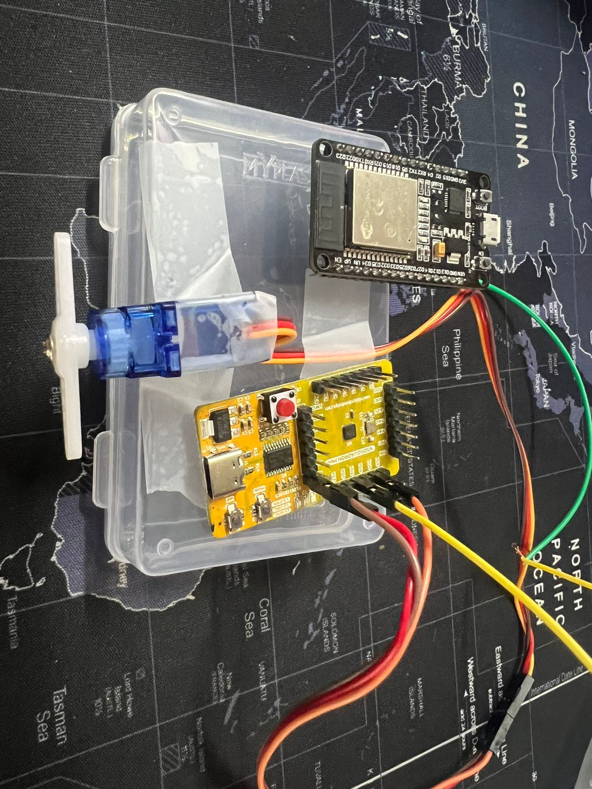

# HOME AUTOMATION USING ARDUINO IOT CLOUD 

## PROJECT OVERVIEW
In this project, We build a system that utilises CH32V003 RISC-V processor and the Arduino IOT cloud to convert traditional home appliances into IoT-enabled devices. The system incorporates the ESP32 for its built-in Wi-Fi and Bluetooth capabilities. When the user sends an ON/OFF command through the Arduino IOT cloud app/web appplication, the signal is transmitted to the ESP32 via Wi-Fi, which then activates a GPIO port in the VSDsquardron mini. This signal controls a servo motor connected to the VSDsquadron mini, allowing for remote operation of the home appliances.  By integrating the Arduino IOT cloud with the CH32V003 RISC-V processor and ESP32, users can conveniently manage their appliances from anywhere using a smartphone or tablet. This enhances user convenience, improves energy efficiency by enabling remote power management, and adds a layer of automation to household tasks. Additionally, the use of IoT technology increases the versatility and functionality of conventional home appliances, aligning them with modern smart home standards.

## PINOUT DIAGRAM

## Table for pin connections

| Servo motor(SG90)  | CH32V003x |
| ------------- | ------------- |
| Control pin (Blue wire) | PD4 |
| Power pin (Red wire)  | 5V |
| Ground pin (black wire) | GND |

| ESP32 | CH32V003x |
| ------------- | ------------- |
| Digital pin 4 (Orange wire) | PD2 |

## Components required
| Components| Quantity |
| ------------- | ------------- |
| VSDsquadron mini | 1 |
| ESP 32  | 1 |
| servo motor(SG90) | 1 |
| Jumper wires | As per required |

## Demonstration video

## Fault injection

Injecting a fault into a microcontroller code can be done in several ways, depending on what kind of fault you want to simulate. Here are a few possibilities:

- Voltage Glitching: This involves momentarily lowering the voltage supply to the microcontroller, which can cause it to execute instructions incorrectly or behave unpredictably.

- Clock Glitching: Similar to voltage glitching, this involves momentarily disrupting the clock signal to the microcontroller, causing it to execute instructions incorrectly.
-Memory Corruption: Writing data to random memory locations can simulate faults caused by cosmic rays or other forms of radiation.

- Instruction Corruption: Modifying the program instructions in memory can cause the microcontroller to execute unintended instructions.

- Peripheral Fault Injection: Intentionally sending incorrect data to peripherals, such as sensors or communication modules, can simulate faults in external components.

since we work with a servo motor, its supposed to perform its action periodically when it receives the commands from input pin. To introduce a fault scenario where the servo motor behaves unexpectedly or inaccurately due to a random glitch. We can simulate this by randomly delaying the servo control pulses within a certain range, causing undesired behaviour behavior. To inject the fault using an ESP32 board, we can modify the code to receive commands from the ESP32 over serial communication to introduce the fault. Here's how we can do it.

### Fault Injection Using Voltage Glitching

Fault injection using voltage glitching is a technique employed in security research and hardware testing to induce transient faults in digital circuits. By momentarily disrupting the voltage supply to a target device, it's possible to cause unintended behavior such as incorrect instruction execution or memory corruption. we detail the process of performing fault injection using voltage glitching with an external board like the ESP32 to inject faults into a CH32V0003 microcontroller.

### Fault Injection Using Laser

  Fault injection using lasers is an advanced technique employed in the field of hardware security and reliability testing. It involves using focused laser beams to induce faults in integrated circuits (ICs) by altering their internal operations. This method is highly precise and can target specific areas of the chip to observe how faults affect the device's behavior.

  The core principle behind laser fault injection is to use a laser to introduce transient or permanent faults in a semiconductor device. The energy from the laser can create localized heating, ionization, or even physical damage to the silicon and its structures. The result is a disturbance in the normal operation of transistors and other circuit elements.

**Equipment and Setup**
- Laser Source: A high-precision laser capable of delivering controlled pulses. The wavelength is typically in the infrared range (e.g., 1064 nm), as silicon is more transparent at these wavelengths, allowing deeper penetration.
- Optical System: Lenses and mirrors to focus the laser beam onto the desired location on the chip.
- Microscope: High-resolution microscope to accurately position the laser spot on the chip.
- Positioning System: Precision stages to move the chip under the laser for targeting specific areas.
Control and Measurement Systems: Equipment to control the laser parameters (e.g., intensity, duration) and to measure the chip's response to the faults.

**Process**
- Preparation: The chip is prepared by decapping it, which involves removing the package to expose the silicon die.
- Targeting: The chip is placed under the microscope and the laser is focused on the area of interest.
- Injection: The laser is pulsed to inject faults. Parameters such as pulse duration, intensity, and repetition rate are carefully controlled.
- Observation: The chip's response to the laser-induced faults is monitored using electrical probes or other diagnostic tools.

Refer to this [video](https://youtu.be/s3f1zNpzINY?si=C5WTHMIiiGA5-gdB).

## Fault injection Demonstration video

